# ing-sw-2018-Pecchia-Peretti-Tibaldi
Repo for Software Engineering final project 2018.
### Team members:
* Pecchia Stefano - 845853 - 10499793
* Peretti Edoardo - 848914 - 10545327
* Tibaldi Alberto - 807775 - 10424105

## Requirements
Java JDK 10 and JRE 10 \
Maven

## Setup
* Run ```mvn compile```
* Run ```mvn package```
* Place the Server jar in the same directory containing the configfiles folder
* Launch the java RMI registry
* Run ```java -jar Server.jar``` to start the server
* Run ```java -jar Client.jar``` to start the client

## Game Screenshots

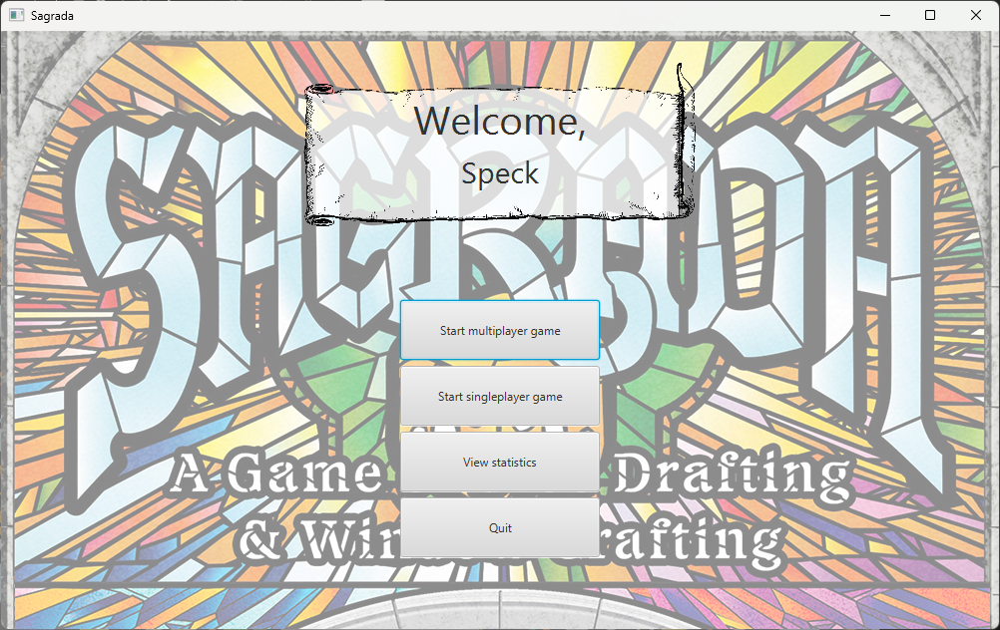
*Game home screen*
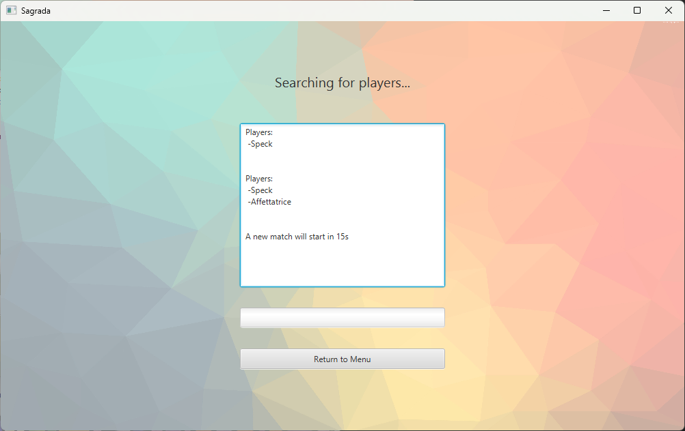
*Waiting lobby*
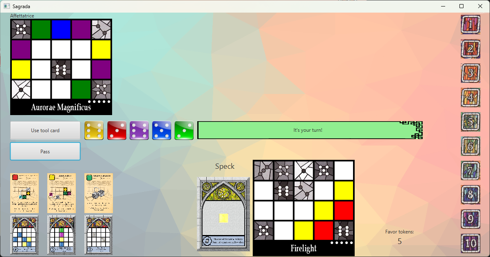
*Game board*

## Test Coverage and Sonar
For the model the test coverage is the following


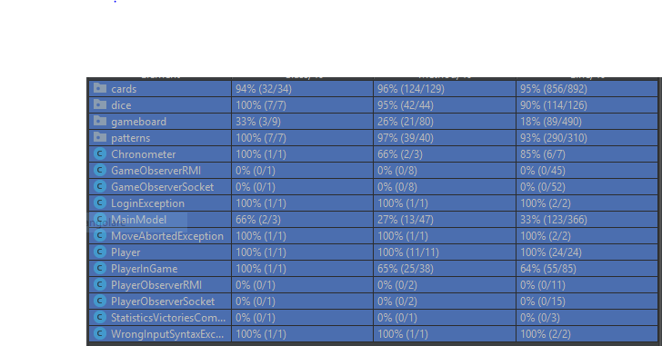

##### Sonar analysis
Most of the Code Smell are suggestions to use Logger instead of System.out

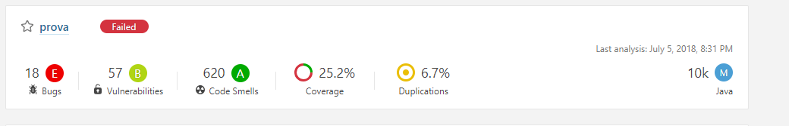
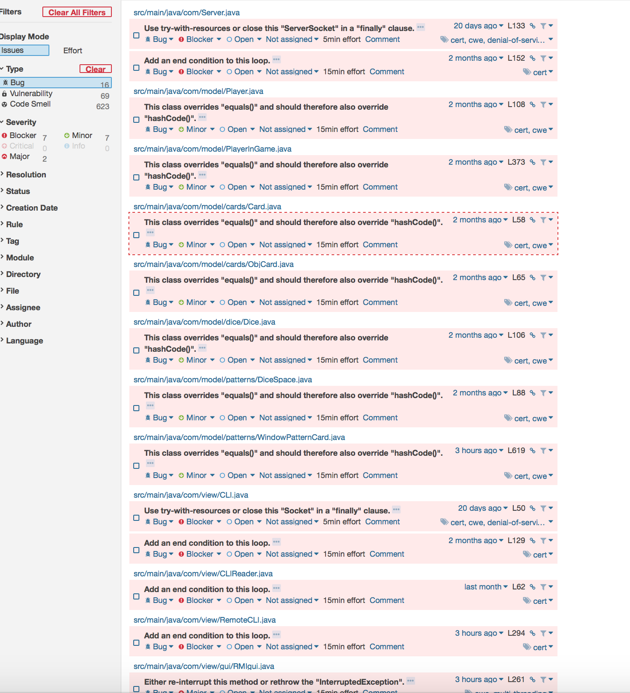
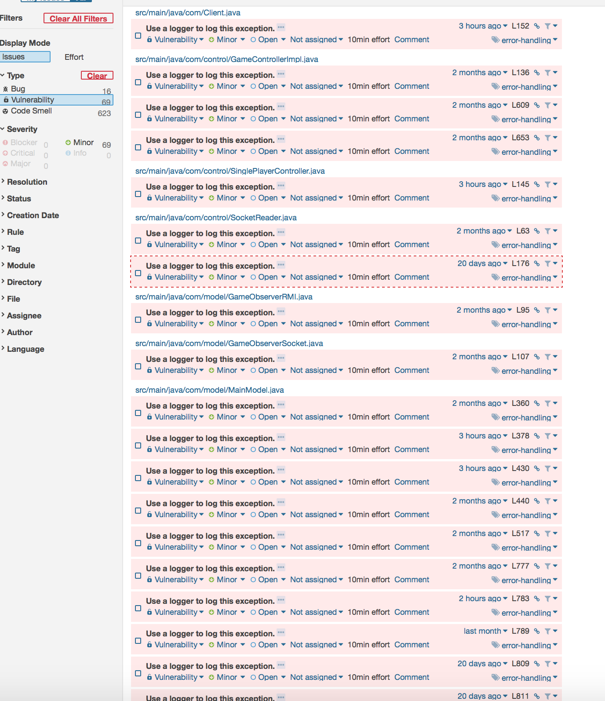
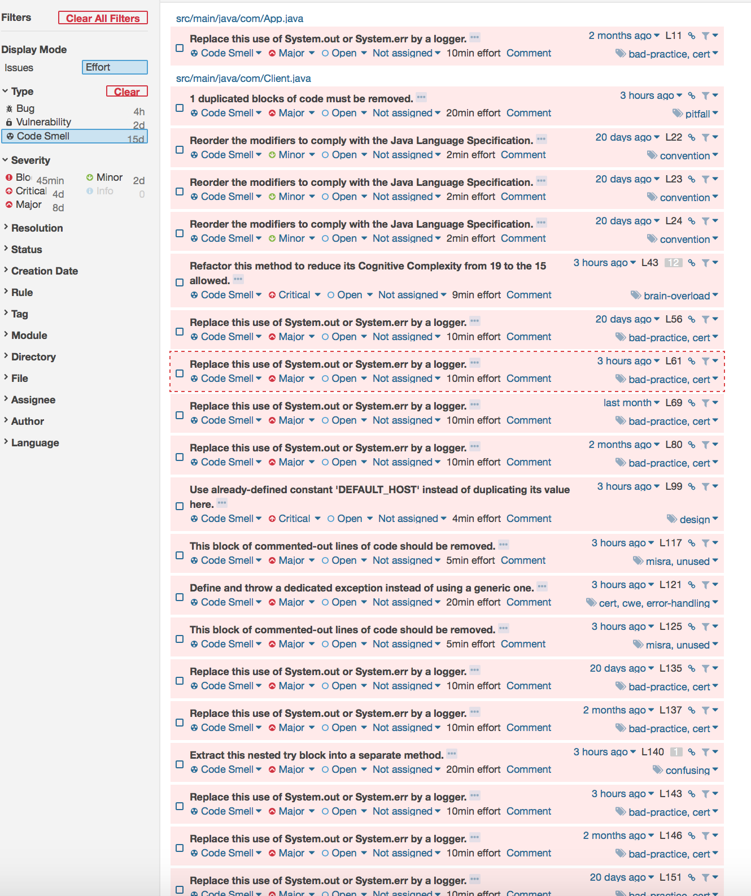

## UML class diagram
### Model
#### GameModel
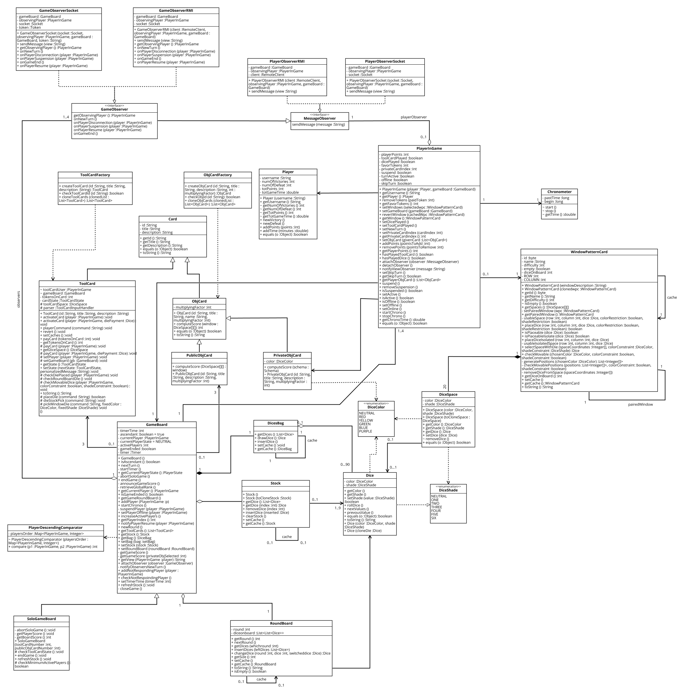
#### Public Object Cards
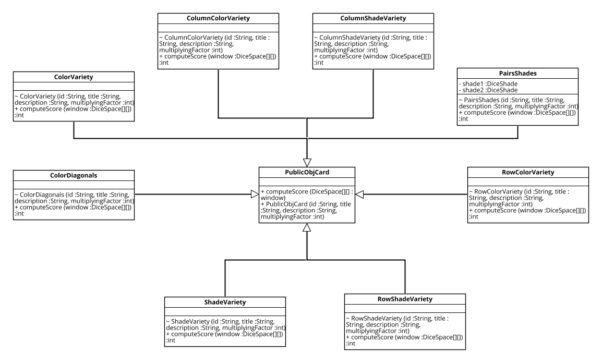
#### ToolCards
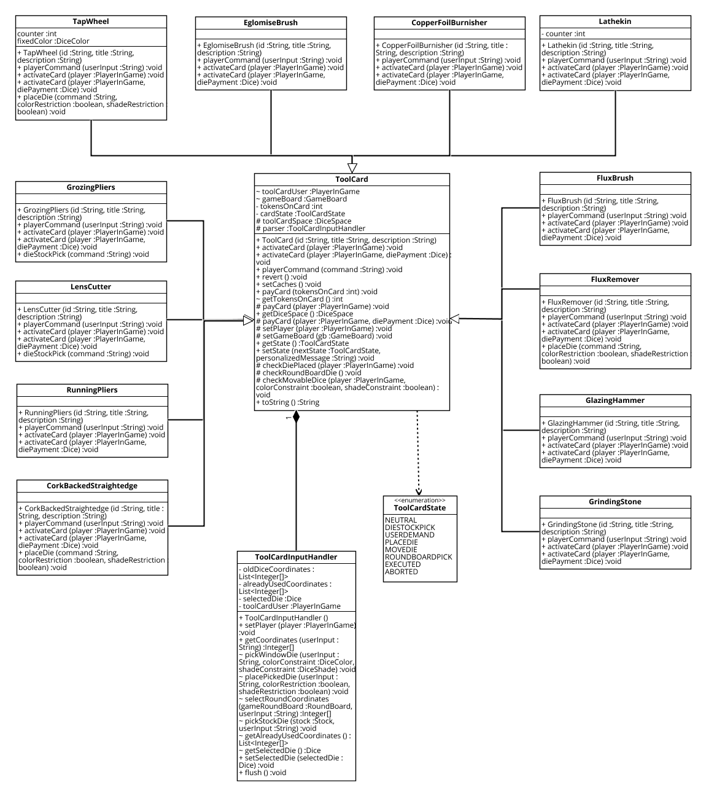

### MVC
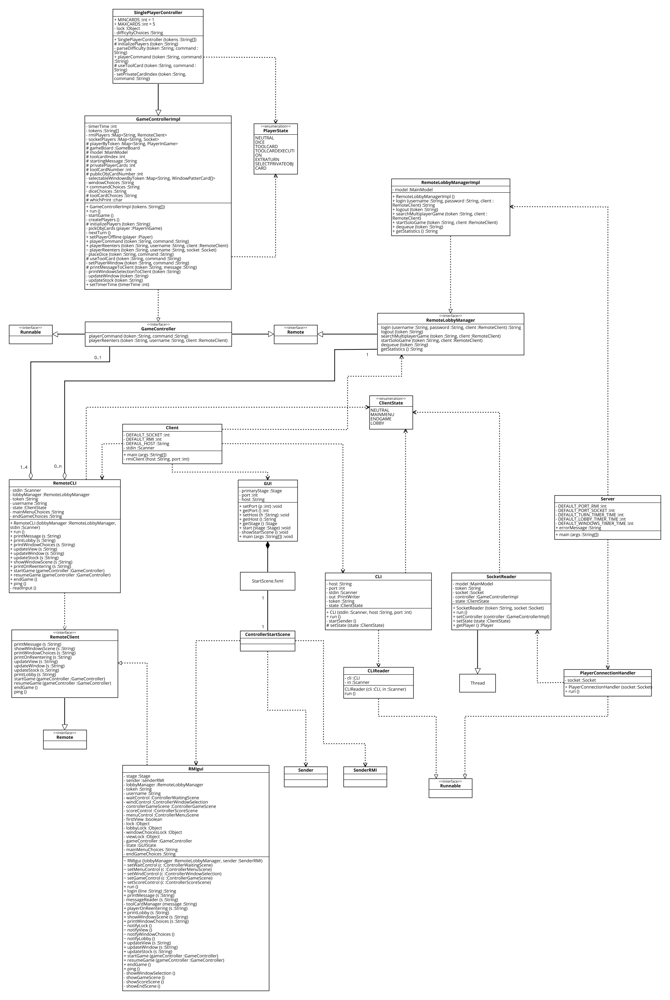

### GUI
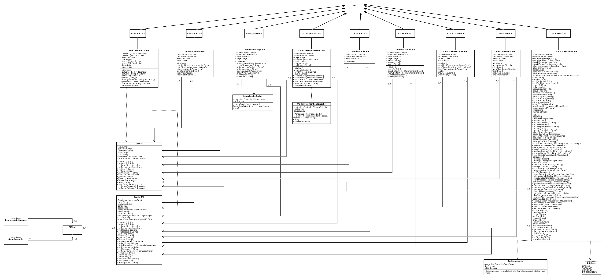
#### Vectorial Round Board
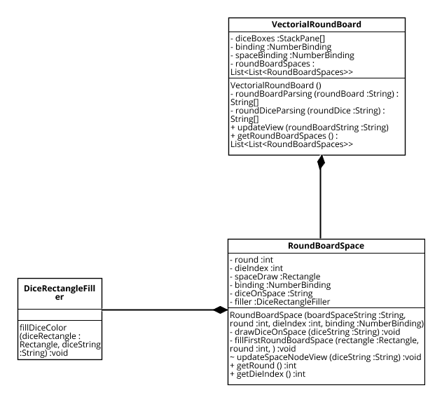
#### Vectorial Window
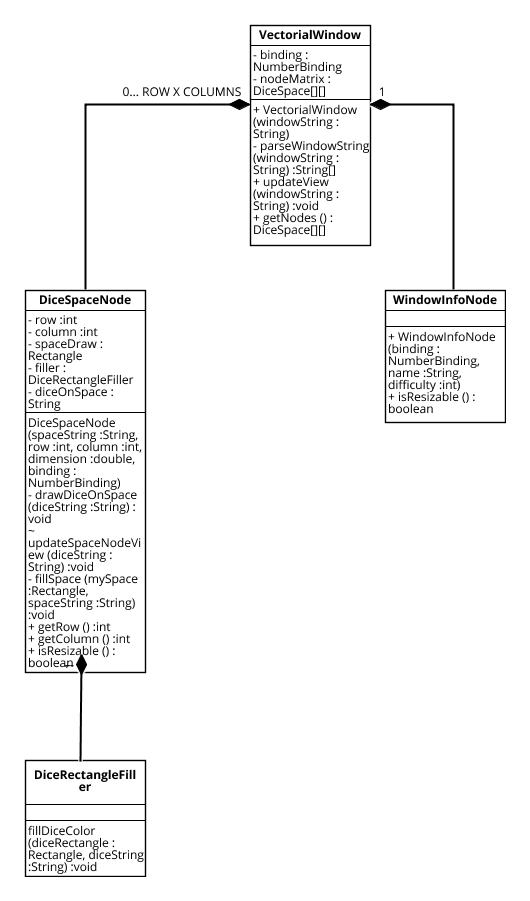

## Features implemented

* Complete Rules
* RMI
* Socket
* CLI
* GUI
* Single Player (only cli)
* Dynamic Scheme Cards
* Multiple Games
* Game Statistics

## Design Choices
### Networking and Turn Management
The game support both RMI and Socket Client at the same time even in the same match.
Nevertheless there is only one type of controller that manages both technologies.
To do this, all the communications between clients and server are made through strings.
As a consequence of this, on the client side there is no need to have any type of local model, eliminating the risk of inconsistency and redundancy.
To be able to handle multiple matches concurrently, a new istance of the controller is created for every match and it runs in a separated thread.

Once the game has started, the server handles the turn management independently from the clients behavior.
At any time the server maintains a reference to the current player and it changes it when the current player pass or when the timer has expired.
The clients can send requests to the controller at any moment and, if it is the case that it is not their turn, the requests will be simply ignored.


### Tool Card Rules Clarification
* Every ToolCard execution can be aborted any time the user has to interact
with the card. When aborted the user loses his tokens and the state of the game
is reverted at right before the toolcard activation.
* CorkBackedStraightedge: to give a sense to CorkBackedStraightedge usage in the first
turn the user can place the die in an isolated space not necessarily near the border
when the window is empty
* In the cards that draft die, if the die is not placeable it is inserted back in the stock.
* In the cards that modify a stock die, if the modified die is not placeable, the dice is changed back
to his prior state and inserted in the stock
* TapWheel: The user can decide to move 0, 1 or 2 dice. When he activates this card the first question is if he wants to
move a die.If he decides to not move any die then the execution terminates. It seems a stupid move but the card effect
states that the user can move UP TO 2 dice, meaning that he can move 0 dice too, maybe just to increase the cost
of the card if not yet activated
* Lathekin: The card effect states that the user has to move 2 dice. If the user can't move the second die the toolcard is aborted,
meaning that his previous moved dice is reverted back to his position before the activation
* In mover ToolCards the user can't move the die back where it was. In double mover ToolCards the user can't move two times the same dice

* If the timer stops during a ToolCard execution the state of the game is reverted at before the activation of the ToolCard but the player that
activated the card doesn't receive his tokens back. This is also valid when the player modifies a stock die and the modified die can be placed
